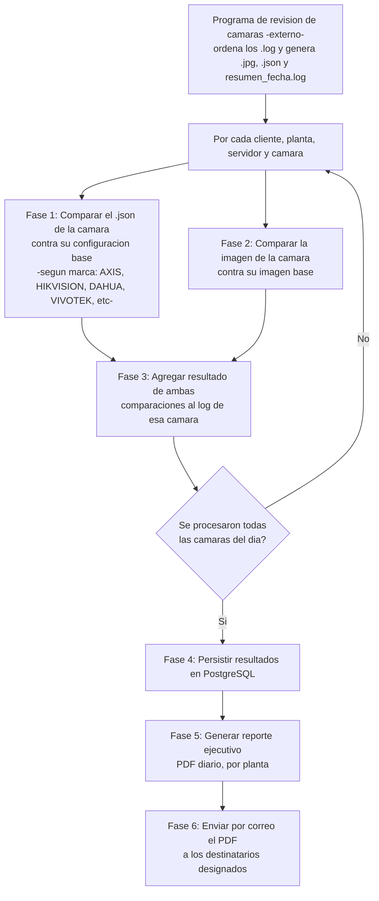

# ROADMAP - Plant Report

## Objetivo general

Automatizar la revisión de plantas: validar que la configuración de cada cámara no haya cambiado
y que no se haya movido (comparando su `.json` y su imagen contra una referencia base), completar
el log con el resultado de esas validaciones, persistir todo en una base de datos, generar un
reporte ejecutivo con los hallazgos y enviarlo por correo a los destinatarios designados.

> El ordenamiento de los `.log` de revisión **no** es parte de este proyecto: lo hace el programa
> de revisión de cámaras (externo a este repo) antes de que los archivos lleguen aquí. Este
> proyecto asume que recibe los `.log` ya ordenados y arranca desde la comparación de cámaras.

## Estructura de datos (contexto)

Ubicación y estructura real de carpetas (confirmada explorando el disco):

```text
D:\Imágenes\Quantum Labs\Check Plants\
  [Cliente]\                     (ej. AbInBev, Others)
    [NN- Mes]\                   (ej. "09- Septiembre")
      [ddmmyy]\                  (ej. "180926" = 18/09/26, una carpeta por día de corrida)
        [PLANTA]\                (ej. APAN, ATLANTICO, MEDELLIN... una planta puede tener
                                   más de un servidor, ej. MEXICO -> QBYMSPROD07 y QBYMSPROD08)
          [SERVIDOR]\            (ej. QLYMSPROD03)
            [SERVIDOR].log       (log de la corrida completa de ese servidor/planta)
            [CAMARA].jpg         (imagen cruda tomada de la cámara)
            [CAMARA].json        (dump completo de configuración de la cámara; el esquema
                                   depende del fabricante — ver nota de marcas más abajo)
            [CAMARA]_ai.jpg      (imagen procesada/anotada, probablemente salida de IA)
```

Con datos de ejemplo (18/09/2026): 2 clientes, 10 plantas, 11 servidores, 399 imágenes .jpg,
14 archivos .log. Solo existe la carpeta del día actual (no hay histórico de días previos en
este disco todavía).

Para desarrollo/pruebas hay un mirror local de esta misma estructura en `Test/Check Plants/`
dentro del repo (con datos reales pero desconectado de producción), que el usuario va subiendo
manualmente con logs de días nuevos. Esa carpeta está en `.gitignore` (es desechable, no se
versiona) — cualquier código que lea `CHECK_PLANTS_ROOT` debe poder apuntar tanto a la ruta real
(`D:\Imágenes\Quantum Labs\Check Plants`) como a esta carpeta de prueba vía `.env`.

El `.log` es un log de proceso con timestamp y nivel (INFO/ERROR), que registra, por servidor:
apertura de túneles SSH, ping, y por cada cámara: IP, verificación de puerto 80, obtención de
"Imagen IA", "Imagen cámara", "Configuración" y tiempo de proceso. Incluye errores (ej.
`Timed out [111]`) cuando una cámara no responde. Ejemplo real visto en `QLYMSPROD03.log`:

```text
APAN - 18/09/2026 - 19:06
[19:06:49] INFO    Ping to Server QLYMSPROD03 on Plant APAN
[19:06:56] INFO    Total de camaras 12, Camaras Activas 11 en el puerto: 8045
[19:06:56] INFO    ENE IP: 192.168.20.31
[19:06:56] INFO    ENE: Puerto 80       OK                  [200]
[19:06:58] INFO    ENE: Imagen IA       OK                  [200]
[19:06:59] INFO    ENE: Imagen cámara   OK                  [200]
[19:07:00] INFO    ENE: Configuración   OK                  [200]
[19:07:00] INFO    ENE: Tiempo de proceso 4.37s
[19:07:08] ERROR   AD1l1: Puerto 80       Timed out           [111]
```

Notas a tener en cuenta en cualquier código que lea o escriba estos `.log`:

- Algunos `.log` (ej. `APIMAN-FASE1` del cliente "Others") pueden contener **varias rondas** en un
  solo archivo (una por puerto/zona escaneado), cada una con su propio `YAML Read successful` /
  `Total de camaras` / cierre `====`.
- El fin de línea varía entre archivos: los de AbInBev usan `LF`, el de `API-MANZANILLO` usa
  `CRLF`. Hay que tolerar ambos.
- Existe un log "por cliente" a nivel superior: `[Cliente]\[Mes]\[ddmmyy]\resumen_[fecha].log`
  (ej. `AbInBev\09- Septiembre\180926\resumen_18-09-2026.log`), con un resumen agregado
  (servidores revisados, cámaras con fallas por planta). Formato totalmente distinto al de los
  `.log` por servidor (sin timestamps por línea).
  - Actualización (22/09/2026): el formato de este `resumen_[fecha].log` cambió — ahora agrega,
    antes de la sección `DETALLE POR PLANTA - CÁMARAS CON FALLAS` de siempre, una sección nueva
    **`DETALLE POR SERVIDOR`**: una tabla con un estado por servidor (`[OK]`, `[CON FALLAS]`,
    `[SIN YAML]`), la planta, el nombre del servidor, y "X/Y cámaras completas".
  - El estado `[SIN YAML]` es nuevo: significa que ese servidor no pudo ni siquiera leer su lista
    de cámaras ese día (ej. `ERROR YAML Connection error [410]` en su `.log`), así que no tiene
    ninguna cámara (ni `.jpg` ni `.json`) esa corrida. Cualquier código que recorra cámaras por
    servidor debe tolerar servidores sin ninguna cámara.
  - El `.log` por servidor/cámara también llega pre-ordenado por cámara desde el programa de
    revisión (ya no es responsabilidad de este proyecto, ver nota al inicio del documento).

## Diagrama de flujo



## Flujo de alto nivel

1. **Comparación de archivos JSON de configuración de las cámaras**
   Para cada cámara, comparar su `[CAMARA].json` (dump de configuración) actual contra una
   referencia base, para detectar cambios de configuración no autorizados/inesperados.
   - Decidido: los archivos se obtienen de la carpeta descrita arriba (`[CAMARA].json` por
     servidor/planta/día).
   - Decidido: la base de referencia **no existe todavía, hay que crearla** (ej. tomar el primer
     `.json` capturado de cada cámara como su base la primera vez que se procese). Una vez creada,
     **queda fija hasta una actualización manual deliberada** — no se refresca sola cada día,
     porque si lo hiciera nunca detectaríamos una desviación real. Falta diseñar el mecanismo para
     "aceptar" un cambio legítimo como la nueva base cuando corresponda.
   - Decidido: es lógica **nueva**, construida desde cero en este proyecto — no reutiliza el
     sistema existente de comparación de imágenes (ese es solo para imagen).
   - Decidido: no se compara el archivo completo. Se compara un **subconjunto curado de campos**,
     agrupados en 4 categorías (Imagen, Video, Compresión, Network), definido **por marca** ya que
     los nombres de campo no coinciden entre fabricantes.
   - Decidido: el resultado se registra como un **campo nuevo** en el `.log` (ej.
     `Config Comparacion: OK/CAMBIO`), sin tocar la línea `Configuración: OK/Timed out` que ya
     existe (esa solo indica si se pudo *descargar* el JSON, no si coincide con la base).
   - **Importante — múltiples fabricantes, con crecimiento esperado**: el `.json` no tiene un
     esquema único, depende de la marca. La lógica de comparación debe diseñarse para que agregar
     una marca nueva sea configuración/extensión, no reescribir el core (mismo principio que se
     usó antes para las reglas de ordenamiento por cliente, aunque ese código ya no exista en este
     repo).
   - **Ya existe código de descarga de configuración por marca** (compartido 22/09/2026 en
     `Test/cameras/{axis,hikvision,dahua,vivotek}.py`, funciones `[Marca]CamConf()`), que confirma
     cómo llega el dump crudo de cada una antes de convertirlo a `.json`:

     | Marca | Endpoint | Formato crudo | Separador de niveles |
     | --- | --- | --- | --- |
     | AXIS | `axis-cgi/param.cgi?action=list&group=root` | texto `root.Nivel1.Nivel2=valor` | `.` |
     | HIKVISION | 7 llamadas ISAPI (`deviceInfo`, `Network/interfaces/1`, `Image/channels/1`, `Streaming/channels/101/`, `time`, `Security/users`, `capabilities`) | XML → dict | jerarquía XML |
     | DAHUA | `configManager.cgi?action=getConfig&name=All` (+2 llamadas `getSystemInfo`) | texto `table.All.Nivel1.Nivel2=valor` | `.` |
     | VIVOTEK | `getparam.cgi` (una sola llamada) | texto `nivel1_nivel2=valor` | `_` |

     Nota menor: HIKVISION también descarga `Security/users` (aparece como `UserList` en el
     `.json`), pero solo expone `userName`/`userLevel` (ej. `admin`/`Administrator`), sin
     contraseñas — no forma parte de las 4 categorías a comparar de todos modos.
   - **Lista de campos a comparar, verificada contra archivos reales de `Test/Check Plants`**
     (AXIS: `CA.json`; HIKVISION: `A1p.json`) — rutas con notación de punto:

     **AXIS**
     - Imagen: `Image.I0.Appearance.{ColorEnabled,MirrorEnabled,Resolution,Rotation}`,
       `ImageSource.I0.DayNight.*`, `ImageSource.I0.DCIris.*`, `ImageSource.I0.Focus.*`,
       `ImageSource.I0.Sensor.*` (Brightness, Contrast, ColorLevel, Sharpness, WhiteBalance*,
       Exposure*, WDR, Gain*, Shutter*, CustomExposureWindow*, etc.)
     - Video: `Image.I0.Stream.{Duration,FPS,NbrOfFrames}`, `Image.I0.MPEG.*` (Complexity,
       ConfigHeaderInterval, FrameSkipMode, ICount, PCount, UserData*, Z*),
       `Image.I0.RateControl.{Mode,Priority}`
     - Compresión: `Image.I0.Appearance.Compression`, `Image.I0.MPEG.H264.{Profile,PSEnabled}`,
       `Image.I0.RateControl.{MaxBitrate,TargetBitrate}`, `Image.I0.SizeControl.MaxFrameSize`
     - Network: `Network.{IPAddress,SubnetMask,DefaultRouter,Broadcast,BootProto,HostName,
       DomainName,Media,DNSServer1,DNSServer2}`, `Network.eth0.{IPAddress,SubnetMask,MACAddress,
       Broadcast}`, `Network.RTSP.{Port,Enabled}`, `Network.HTTP.AuthenticationPolicy`,
       `Network.SSH.Enabled`, `Network.UPnP.Enabled` (a propósito, fuera de alcance por ahora:
       `RTP.R0`-`R7` multicast, `QoS.*`, `IPv6.*`, `dot1x.*` — protocolo avanzado, poco propenso a
       cambiar manualmente y genera mucho ruido)

     **HIKVISION**
     - Imagen: `ImageChannel.{ImageFlip.enabled, IrcutFilter.*, Exposure.*, powerLineFrequency.*,
       Scene.mode, WDR.*, BLC.enabled, NoiseReduce.*, WhiteBalance.*, Sharpness.SharpnessLevel,
       Gain.GainLevel, Shutter.ShutterLevel, Color.*, Dehaze.DehazeMode}`
     - Video: `StreamingChannel.Video.{videoCodecType,videoScanType,videoResolutionWidth,
       videoResolutionHeight,maxFrameRate,GovLength,H264Profile,H265Profile,SVC.enabled,
       SmartCodec.enabled,snapShotImageType}`
     - Compresión: `StreamingChannel.Video.{videoQualityControlType,constantBitRate,fixedQuality,
       vbrUpperCap,vbrLowerCap,keyFrameInterval,smoothing}`
     - Network: `NetworkInterface.IPAddress.{ipAddress,subnetMask,addressingType,
       DefaultGateway.ipAddress,PrimaryDNS.ipAddress,SecondaryDNS.ipAddress}`,
       `NetworkInterface.Link.{MACAddress,speed,duplex,MTU}` (fuera de alcance por ahora:
       `@version`/`@xmlns` de cada bloque — son metadatos de esquema, no configuración real; y
       `Discovery.UPnP/Zeroconf` por ser protocolo secundario)

     **DAHUA y VIVOTEK — pendientes, sin verificar.** No hay ningún `.json` real de estas 2 marcas
     todavía (ni en `Test/Check Plants` ni compartido de otra forma). Por las APIs documentadas de
     cada fabricante hay indicios razonables de qué secciones existen (DAHUA: `Network`,
     `VideoColor`, `Encode`; VIVOTEK: `network_*`, `image_c<N>_*`, `videoin_c<N>_*`), pero **no se
     puede garantizar el nombre exacto de cada campo** (mayúsculas, índices, subclaves) sin un
     dump real — inventar esos nombres arriesga que la comparación busque un campo que no existe
     y falle en silencio.
   - Preguntas abiertas:
     - **Pendiente de entrega**: correr `DahuaCamConf()` y `VivoCamConf()` (ya en
       `Test/cameras/dahua.py` y `Test/cameras/vivotek.py`) contra una cámara real de cada marca y
       compartir el resultado crudo (el dict, o el texto `key=value` antes de convertir), para
       construir su lista de campos con la misma certeza que AXIS/HIKVISION.
     - AXIS puede tener hasta 8 "vistas" por cámara (`Image.I0` a `I7`, `ImageSource.I0` a `I7`);
       en los ejemplos revisados solo `I0` está habilitada. ¿Se compara solo la vista activa
       (`I0`), o las 8 aunque estén deshabilitadas? (aún sin responder)
     - ¿Cómo se identifica la marca de una cámara a partir de su `.json`? Candidato con buena
       confianza para AXIS/HIKVISION: AXIS trae `Brand.Brand == "AXIS"`, HIKVISION trae
       `DeviceInfo["@xmlns"]` conteniendo `hikvision.com`. Falta el equivalente para DAHUA/VIVOTEK
       una vez haya un dump real.
     - ¿Qué se considera un cambio "relevante" a reportar vs. ruido a ignorar (ej. tolerancias
       numéricas, o exact-match estricto en los campos de la lista de arriba)?

2. **Comparación de imágenes de cámara**
   Para cada cámara, obtener la imagen actual y compararla contra una imagen base de referencia
   para detectar si la cámara se movió.
   - Decidido: las imágenes se obtienen de la carpeta descrita arriba (`[CAMARA].jpg` por
     servidor/planta/día).
   - Decidido: ya existe un sistema Python que hace esta comparación. Pendiente que el usuario
     comparta el código para revisarlo, mejorarlo e integrarlo a este proyecto (en vez de
     construir la lógica de comparación desde cero).
   - Decidido: `[CAMARA]_ai.jpg` es la salida de un sistema de IA ya existente (a reutilizar,
     no a reconstruir). Falta confirmar con el script existente qué hace exactamente y si se
     relaciona con la comparación contra la imagen base.
   - Preguntas abiertas:
     - ¿Dónde está el script/proyecto existente? (ruta local, repo, etc.) — el usuario lo
       compartirá cuando lleguemos a esta fase.
     - No se encontró ninguna carpeta de "imagen base"/referencia en el disco explorado — ¿dónde
       vive o cómo se define? (¿la maneja el script existente, es la primera imagen capturada de
       cada cámara, o se cura manualmente?)
     - ¿Cuántas cámaras totales se manejan? (ejemplo visto: ~11-12 cámaras por servidor, 11
       servidores activos ese día)
     - ¿El sistema existente ya define un umbral/método de sensibilidad, o también está pendiente
       de ajustar?
     - Cuando ya haya varios días acumulados, ¿el programa debe procesar solo el día más reciente,
       un rango de fechas, o todos los pendientes de procesar?

3. **Actualización del log**
   Completar el log original con los resultados de la comparación (por cámara).
   - Decidido: se sobrescribe el `.log` original agregándole las líneas con el resultado de la
     comparación (no se genera un archivo aparte).
   - Preguntas abiertas:
     - ¿Qué campos/formato exacto se deben agregar (ej. `[HH:MM:SS] INFO <CAMARA>: Comparación
       con base OK/MOVIDA [score]`, siguiendo el mismo estilo del log actual)? ¿Aplica igual para
       el resultado de la comparación de imagen y el de configuración (Fases 1 y 2)?
     - ¿Qué pasa si el programa se corre más de una vez sobre el mismo log (evitar duplicar
       líneas de resultado)?

4. **Persistencia en base de datos**
   Guardar los resultados (logs + comparaciones) en una base de datos.
   - Decidido: PostgreSQL, ya hay un servidor disponible.
   - Preguntas abiertas:
     - ¿Datos de conexión al servidor (host, puerto, nombre de BD)? ¿Cómo se van a manejar las
       credenciales (variables de entorno, archivo `.env`, etc.)?
     - ¿Ya existe un esquema o hay que diseñarlo desde cero?
     - ¿Se necesita conservar histórico de todas las corridas o solo el estado más reciente?

5. **Reporte ejecutivo**
   Generar un reporte ejecutivo con los resultados.
   - Decidido: formato PDF, generación diaria (automática).
   - Decidido: reporte detallado por planta, dirigido a Gerencia de Operaciones.
   - Pendiente: el contenido específico del reporte (secciones, tablas, gráficos) se definirá
     más adelante.
   - Preguntas abiertas:
     - ¿Qué debe contener exactamente (resumen de cámaras movidas, tablas, gráficos,
       comparativas históricas)?
     - ¿Cómo se dispara la generación diaria (tarea programada/cron, servicio corriendo en
       segundo plano)?
     - ¿Existe una plantilla o identidad visual corporativa a seguir?
     - ¿El `resumen_[fecha].log` por cliente debe incorporarse a este reporte o es solo para
       referencia humana?

6. **Enviar correo con el reporte**
   Enviar por correo el PDF generado en la Fase 5 a las personas designadas para recibirlo.
   - Decidido: el correo debe llevar la estructura/identidad de la empresa (firma, pie de página
     corporativo, etc.), no un correo genérico sin formato.
   - Preguntas abiertas:
     - ¿Quiénes son los destinatarios? ¿Una lista fija, o varía por cliente/planta (ej. cada
       cliente recibe solo el reporte de sus propias plantas)?
     - ¿Con qué servidor/servicio de correo se envía (SMTP corporativo, algún proveedor externo)?
       ¿Dónde se guardan esas credenciales (`.env`)?
     - ¿Existe ya una plantilla de correo/firma corporativa (HTML) a reutilizar, o hay que
       diseñarla?
     - ¿Qué pasa si el envío falla (reintentos, aviso a alguien, quedar registrado en el log)?
     - ¿Va en copia alguien fijo (ej. Gerencia general, el equipo de Quantum Labs)?

## Preguntas generales de ejecución

- Decidido: por ahora la ejecución es manual (vía CLI). La automatización (tarea programada de
  Windows, servicio, etc.) para que el reporte diario salga solo se define más adelante.
- ¿Dónde corre (equipo local, servidor)?
- ¿Necesita interfaz gráfica o es suficiente con línea de comandos?

## Estado

- [ ] Fase 1 definida (comparación de JSON de configuración)
- [ ] Fase 2 definida (comparación de imágenes)
- [ ] Fase 3 definida (actualización del log)
- [ ] Fase 4 definida (persistencia en base de datos)
- [ ] Fase 5 definida (reporte ejecutivo)
- [ ] Fase 6 definida (envío de correo con el reporte)
