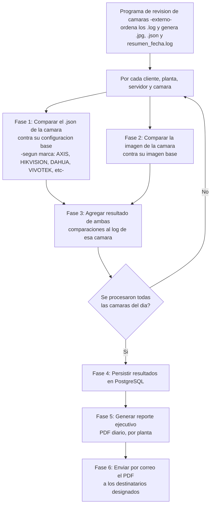

# ROADMAP - Plant Report

## Objetivo general

Automatizar la revisión de plantas: validar que la configuración de cada cámara no haya cambiado
y que no se haya movido (comparando su `.json` y su imagen contra una referencia base), completar
el log con el resultado de esas validaciones, persistir todo en una base de datos, generar un
reporte ejecutivo con los hallazgos y enviarlo por correo a los destinatarios designados.

> El ordenamiento de los `.log` de revisión **no** es parte de este proyecto: lo hace el programa
> de revisión de cámaras (externo a este repo) antes de que los archivos lleguen aquí. Este
> proyecto asume que recibe los `.log` ya ordenados y arranca desde la comparación de cámaras.

## Estructura de datos (contexto)

Ubicación y estructura real de carpetas (confirmada explorando el disco):

```text
D:\Imágenes\Quantum Labs\Check Plants\
  [Cliente]\                     (ej. AbInBev, Others)
    [NN- Mes]\                   (ej. "09- Septiembre")
      [ddmmyy]\                  (ej. "180926" = 18/09/26, una carpeta por día de corrida)
        [PLANTA]\                (ej. APAN, ATLANTICO, MEDELLIN... una planta puede tener
                                   más de un servidor, ej. MEXICO -> QBYMSPROD07 y QBYMSPROD08)
          [SERVIDOR]\            (ej. QLYMSPROD03)
            [SERVIDOR].log       (log de la corrida completa de ese servidor/planta)
            [CAMARA].jpg         (imagen cruda tomada de la cámara)
            [CAMARA].json        (dump completo de configuración de la cámara; el esquema
                                   depende del fabricante — ver nota de marcas más abajo)
            [CAMARA]_ai.jpg      (imagen procesada/anotada, probablemente salida de IA)
```

Con datos de ejemplo (18/09/2026): 2 clientes, 10 plantas, 11 servidores, 399 imágenes .jpg,
14 archivos .log.

> Corrección (02/10/2026): sí existe histórico — ver más abajo. Además, al 01/10/2026 el nivel de
> cliente creció a 4: `AbInBev`, `Api_Manzanillo`, `C5i_Colima`, `Pemex` (antes solo se habían visto
> `AbInBev`/`Others`).

Para desarrollo/pruebas hay un mirror local de esta misma estructura en `Test/Check Plants/`
dentro del repo (con datos reales pero desconectado de producción), que el usuario va subiendo
manualmente con logs de días nuevos. Esa carpeta está en `.gitignore` (es desechable, no se
versiona) — cualquier código que lea `CHECK_PLANTS_ROOT` debe poder apuntar tanto a la ruta real
(`D:\Imágenes\Quantum Labs\Check Plants`) como a esta carpeta de prueba vía `.env`.

**Histórico real, descubierto 02/10/2026**: `D:\Imágenes\Quantum Labs\Check Plants\1- OLD\` tiene
**124 días en 2025** (mayo a diciembre) y **18 en 2026** — casi dos años de capturas diarias reales
por cámara. Es la fuente usada para los Experimentos 1, 3, 4, 5 y 6 de la Fase 2 (ver esa sección),
y la alternativa elegida en vez de dar acceso directo a cámaras de producción para ampliar el piso
de ruido (02/10/2026): minar más días de este histórico es casi gratis y no toca infraestructura
viva, a diferencia de conectarse en vivo a cámaras remotas (que además viven detrás de túneles que
administra el programa externo de revisión — ver `proxy_ip`/`proxy_port` en `Test/cameras/*.py`).

- **2026** sigue la estructura de arriba: `2026\[Cliente]\[NN- Mes]\[ddmmyy]\[PLANTA]\[SERVIDOR]\`.
- **2025 usa un formato distinto y más viejo**: `2025\[NN-Mes]\[ddmmyy]\[planta+servidor en
  minúsculas]\`, sin carpeta de cliente y con planta y servidor fundidos en un solo nombre (ej.
  `zacatecas01`, `mexico07`). Cualquier código que recorra el histórico completo tiene que tolerar
  ambos formatos, no solo el de 2026.

El `.log` es un log de proceso con timestamp y nivel (INFO/ERROR), que registra, por servidor:
apertura de túneles SSH, ping, y por cada cámara: IP, verificación de puerto 80, obtención de
"Imagen IA", "Imagen cámara", "Configuración" y tiempo de proceso. Incluye errores (ej.
`Timed out [111]`) cuando una cámara no responde. Ejemplo real visto en `QLYMSPROD03.log`:

```text
APAN - 18/09/2026 - 19:06
[19:06:49] INFO    Ping to Server QLYMSPROD03 on Plant APAN
[19:06:56] INFO    Total de camaras 12, Camaras Activas 11 en el puerto: 8045
[19:06:56] INFO    ENE IP: 192.168.20.31
[19:06:56] INFO    ENE: Puerto 80       OK                  [200]
[19:06:58] INFO    ENE: Imagen IA       OK                  [200]
[19:06:59] INFO    ENE: Imagen cámara   OK                  [200]
[19:07:00] INFO    ENE: Configuración   OK                  [200]
[19:07:00] INFO    ENE: Tiempo de proceso 4.37s
[19:07:08] ERROR   AD1l1: Puerto 80       Timed out           [111]
```

Notas a tener en cuenta en cualquier código que lea o escriba estos `.log`:

- Algunos `.log` (ej. `APIMAN-FASE1` del cliente "Others") pueden contener **varias rondas** en un
  solo archivo (una por puerto/zona escaneado), cada una con su propio `YAML Read successful` /
  `Total de camaras` / cierre `====`.
- El fin de línea varía entre archivos: los de AbInBev usan `LF`, el de `API-MANZANILLO` usa
  `CRLF`. Hay que tolerar ambos.
- Existe un log "por cliente" a nivel superior: `[Cliente]\[Mes]\[ddmmyy]\resumen_[fecha].log`
  (ej. `AbInBev\09- Septiembre\180926\resumen_18-09-2026.log`), con un resumen agregado
  (servidores revisados, cámaras con fallas por planta). Formato totalmente distinto al de los
  `.log` por servidor (sin timestamps por línea).
  - Actualización (22/09/2026): el formato de este `resumen_[fecha].log` cambió — ahora agrega,
    antes de la sección `DETALLE POR PLANTA - CÁMARAS CON FALLAS` de siempre, una sección nueva
    **`DETALLE POR SERVIDOR`**: una tabla con un estado por servidor (`[OK]`, `[CON FALLAS]`,
    `[SIN YAML]`), la planta, el nombre del servidor, y "X/Y cámaras completas".
  - El estado `[SIN YAML]` es nuevo: significa que ese servidor no pudo ni siquiera leer su lista
    de cámaras ese día (ej. `ERROR YAML Connection error [410]` en su `.log`), así que no tiene
    ninguna cámara (ni `.jpg` ni `.json`) esa corrida. Cualquier código que recorra cámaras por
    servidor debe tolerar servidores sin ninguna cámara.
  - El `.log` por servidor/cámara también llega pre-ordenado por cámara desde el programa de
    revisión (ya no es responsabilidad de este proyecto, ver nota al inicio del documento).

## Diagrama de flujo


```mermaid
flowchart TD
    A["Programa de revision de camaras -externo-<br/>ordena los .log y genera .jpg, .json y resumen_fecha.log"]
    A --> B["Por cada cliente, planta, servidor y camara"]

    B --> C["Fase 1: Comparar el .json de la camara<br/>contra su configuracion base<br/>-segun marca: AXIS, HIKVISION, DAHUA, VIVOTEK, etc-"]
    B --> D["Fase 2: Comparar la imagen de la camara<br/>contra su imagen base"]

    C --> E["Fase 3: Agregar resultado de ambas<br/>comparaciones al log de esa camara"]
    D --> E

    E --> F{"Se procesaron todas<br/>las camaras del dia?"}
    F -->|No| B
    F -->|Si| G["Fase 4: Persistir resultados en PostgreSQL"]

    G --> H["Fase 5: Generar reporte ejecutivo<br/>PDF diario, por planta"]
    H --> I["Fase 6: Enviar por correo el PDF<br/>a los destinatarios designados"]
```

## Flujo de alto nivel

1. **Comparación de archivos JSON de configuración de las cámaras**
   Para cada cámara, comparar su `[CAMARA].json` (dump de configuración) actual contra una
   referencia base, para detectar cambios de configuración no autorizados/inesperados.
   - **Implementado (23/09/2026)** para AXIS, HIKVISION y VIVOTEK, en `config_compare.py` +
     `main.py`: detección de marca por contenido, extracción de campos curados por marca/categoría,
     creación automática de la base si falta, y comparación exacta contra la base. Probado end to
     end contra los 144 `.json` de `Test/Check Plants` (144 detectados correctamente, 0 sin
     soportar), con `BASE CREADA` en la primera corrida y `OK` en la segunda (idempotente), y con
     un cambio simulado (IP de una cámara) correctamente detectado como `CAMBIO` con el campo,
     valor base y valor actual exactos. DAHUA queda pendiente de su dump real, sin bloquear a las
     otras 3 (agregar una marca es una función `_dahua_fields()` + huella de detección más, no
     tocar el core).
   - Decidido: los archivos se obtienen de la carpeta descrita arriba (`[CAMARA].json` por
     servidor/planta/día).
   - Decidido: la base de referencia **no existe todavía, hay que crearla** (ej. tomar el primer
     `.json` capturado de cada cámara como su base la primera vez que se procese). Una vez creada,
     **queda fija hasta una actualización manual deliberada** — no se refresca sola cada día,
     porque si lo hiciera nunca detectaríamos una desviación real. Falta diseñar el mecanismo para
     "aceptar" un cambio legítimo como la nueva base cuando corresponda.
   - Decidido: es lógica **nueva**, construida desde cero en este proyecto — no reutiliza el
     sistema existente de comparación de imágenes (ese es solo para imagen).
   - Decidido: no se compara el archivo completo. Se compara un **subconjunto curado de campos**,
     agrupados en 4 categorías (Imagen, Video, Compresión, Network), definido **por marca** ya que
     los nombres de campo no coinciden entre fabricantes.
   - Decidido: el resultado se registra como un **campo nuevo** en el `.log` (ej.
     `Config Comparacion: OK/CAMBIO`), sin tocar la línea `Configuración: OK/Timed out` que ya
     existe (esa solo indica si se pudo *descargar* el JSON, no si coincide con la base).
   - Decidido (23/09/2026): la base de referencia vive en una carpeta nueva, propia de este
     proyecto, apuntada por una variable de entorno nueva (ej. `CONFIG_BASE_ROOT` en `.env`), con
     la misma estructura que `Check Plants` pero **sin la carpeta de fecha** (es una referencia
     viva, no un histórico diario): `[Cliente]\[Planta]\[Servidor]\[CAMARA].json`. La primera vez
     que se procesa una cámara sin base, se copia su `.json` de ese día como base y el log registra
     `Config Comparacion: BASE CREADA` (no "OK" ni "CAMBIO", porque no hubo comparación real).
   - Decidido: si un campo de la lista curada no existe en el `.json` de una cámara puntual (puede
     pasar según modelo/configuración), se ignora ese campo para esa cámara en vez de marcar error.
   - Decidido: formato de la línea nueva en el log, siguiendo el estilo visual de las líneas ya
     existentes: `[HH:MM:SS] INFO    <CAMARA>: Config Comparacion   OK/CAMBIO/BASE CREADA`.
   - Decidido: la marca de cada cámara se detecta **leyendo el contenido de su `.json`** (huellas
     de marca, ver más abajo), no desde un inventario externo — no existe uno reutilizable.
   - Decidido: en AXIS, solo se comparan las vistas con `Enabled: "yes"` dentro de `Image.I0`-`I7` /
     `ImageSource.I0`-`I7` (normalmente solo `I0`); las deshabilitadas se ignoran por ser puro
     ruido (siempre en su valor de fábrica).
   - Decidido: el criterio de "cambió" es **coincidencia exacta** de texto por campo (sin
     tolerancias numéricas) — se ajustará después si genera demasiado ruido en la práctica.
   - **Importante — múltiples fabricantes, con crecimiento esperado**: el `.json` no tiene un
     esquema único, depende de la marca. La lógica de comparación debe diseñarse para que agregar
     una marca nueva sea configuración/extensión, no reescribir el core (mismo principio que se
     usó antes para las reglas de ordenamiento por cliente, aunque ese código ya no exista en este
     repo).
   - **Ya existe código de descarga de configuración por marca** (compartido 22/09/2026 en
     `Test/cameras/{axis,hikvision,dahua,vivotek}.py`, funciones `[Marca]CamConf()`), que confirma
     cómo llega el dump crudo de cada una antes de convertirlo a `.json`:

     | Marca | Endpoint | Formato crudo | Separador de niveles |
     | --- | --- | --- | --- |
     | AXIS | `axis-cgi/param.cgi?action=list&group=root` | texto `root.Nivel1.Nivel2=valor` | `.` |
     | HIKVISION | 7 llamadas ISAPI (`deviceInfo`, `Network/interfaces/1`, `Image/channels/1`, `Streaming/channels/101/`, `time`, `Security/users`, `capabilities`) | XML → dict | jerarquía XML |
     | DAHUA | `configManager.cgi?action=getConfig&name=All` (+2 llamadas `getSystemInfo`) | texto `table.All.Nivel1.Nivel2=valor` | `.` |
     | VIVOTEK | `getparam.cgi` (una sola llamada) | texto `nivel1_nivel2=valor` | `_` |

     Nota menor: HIKVISION también descarga `Security/users` (aparece como `UserList` en el
     `.json`), pero solo expone `userName`/`userLevel` (ej. `admin`/`Administrator`), sin
     contraseñas — no forma parte de las 4 categorías a comparar de todos modos.
   - **Lista de campos a comparar, verificada contra archivos reales de `Test/Check Plants`**
     (AXIS: `CA.json`; HIKVISION: `A1p.json`) — rutas con notación de punto:

     **AXIS**
     - Imagen: `Image.I0.Appearance.{ColorEnabled,MirrorEnabled,Resolution,Rotation}`,
       `ImageSource.I0.DayNight.*`, `ImageSource.I0.DCIris.*`, `ImageSource.I0.Focus.*`,
       `ImageSource.I0.Sensor.*` (Brightness, Contrast, ColorLevel, Sharpness, WhiteBalance*,
       Exposure*, WDR, Gain*, Shutter*, CustomExposureWindow*, etc.)
     - Video: `Image.I0.Stream.{Duration,FPS,NbrOfFrames}`, `Image.I0.MPEG.*` (Complexity,
       ConfigHeaderInterval, FrameSkipMode, ICount, PCount, UserData*, Z*),
       `Image.I0.RateControl.{Mode,Priority}`
     - Compresión: `Image.I0.Appearance.Compression`, `Image.I0.MPEG.H264.{Profile,PSEnabled}`,
       `Image.I0.RateControl.{MaxBitrate,TargetBitrate}`, `Image.I0.SizeControl.MaxFrameSize`
     - Network: `Network.{IPAddress,SubnetMask,DefaultRouter,Broadcast,BootProto,HostName,
       DomainName,Media,DNSServer1,DNSServer2}`, `Network.eth0.{IPAddress,SubnetMask,MACAddress,
       Broadcast}`, `Network.RTSP.{Port,Enabled}`, `Network.HTTP.AuthenticationPolicy`,
       `Network.SSH.Enabled`, `Network.UPnP.Enabled` (a propósito, fuera de alcance por ahora:
       `RTP.R0`-`R7` multicast, `QoS.*`, `IPv6.*`, `dot1x.*` — protocolo avanzado, poco propenso a
       cambiar manualmente y genera mucho ruido)

     **HIKVISION**
     - Imagen: `ImageChannel.{ImageFlip.enabled, IrcutFilter.*, Exposure.*, powerLineFrequency.*,
       Scene.mode, WDR.*, BLC.enabled, NoiseReduce.*, WhiteBalance.*, Sharpness.SharpnessLevel,
       Gain.GainLevel, Shutter.ShutterLevel, Color.*, Dehaze.DehazeMode}`,
       `PTZStatus.AbsoluteHigh.absoluteZoom` — agregado 03/10/2026 (ver Fase 2, Experimento 8,
       Hallazgo 4: el zoom no lo detecta la comparación de imagen, decidido que se vigile aquí).
       **Implementado en `config_compare.py` pero incompleto**: solo presente en cámaras con lente
       motorizado (sufijo `IZS`/`IZHS` o similar — el parque es variable, mezcla de marcas y modelos,
       algunos motorizados y otros no, confirmado por el usuario 03/10/2026); en lente fijo el campo
       no existe y se ignora igual que cualquier campo ausente. **Depende de un cambio fuera de este
       repo**: la descarga (`HikvCamConf()` en el programa externo de revisión, no en este proyecto)
       no llama hoy a `PTZCtrl/channels/1/status` — hay que agregar esa llamada ahí para que el campo
       llegue a existir en el `.json` que este proyecto lee. Sin ese cambio externo, el campo queda
       siempre ausente y nunca se compara (no falla, pero tampoco vigila nada).
     - Video: `StreamingChannel.Video.{videoCodecType,videoScanType,videoResolutionWidth,
       videoResolutionHeight,maxFrameRate,GovLength,H264Profile,H265Profile,SVC.enabled,
       SmartCodec.enabled,snapShotImageType}`
     - Compresión: `StreamingChannel.Video.{videoQualityControlType,constantBitRate,fixedQuality,
       vbrUpperCap,vbrLowerCap,keyFrameInterval,smoothing}`
     - Network: `NetworkInterface.IPAddress.{ipAddress,subnetMask,addressingType,
       DefaultGateway.ipAddress,PrimaryDNS.ipAddress,SecondaryDNS.ipAddress}`,
       `NetworkInterface.Link.{MACAddress,speed,duplex,MTU}` (fuera de alcance por ahora:
       `@version`/`@xmlns` de cada bloque — son metadatos de esquema, no configuración real; y
       `Discovery.UPnP/Zeroconf` por ser protocolo secundario)

     **VIVOTEK** (verificado 22/09/2026 contra `Test/VIVOTEK-IP9181-192.168.81.80.json`, cámara
     real `IP9181-LPC-v2`; dump plano `nivel1_nivel2=valor` reconstruido a dict anidado por
     `txt_to_json`, un solo canal de video `c0`, hasta 3 streams `s0/s1/s2`):
     - Imagen: `image.c0.{brightness,brightnesspercent,saturation,saturationpercent,contrast,
       contrastpercent,sharpness,sharpnesspercent,gammacurve,hlm}`, `image.c0.defog.{mode,
       strength}`, `image.c0.eis.{mode,strength}`, `image.c0.dnr.{mode,strength}`,
       `image.c0.scene.mode`, `videoin.c0.{whitebalance,exposurelevel,irismode,maxgain,mingain,
       color,flip,mirror,rotate,cmosfreq}`, `videoin.c0.wdrc.{mode,strength}`,
       `videoin.c0.wdrpro.mode`, `videoin.c0.piris.{mode,position}`,
       `videoin.c0.aespeed.{mode,speedlevel,sensitivity}`
     - Video: `videoin.c0.sN.codectype`, `videoin.c0.sN.resolution`,
       `videoin.c0.sN.{h264,h265}.{profile,maxframe,prioritypolicy}`,
       `videoin.c0.sN.mjpeg.maxframe` (N = 0, 1, 2 — un stream por cada perfil de calidad)
     - Compresión: `videoin.c0.sN.{h264,h265}.{ratecontrolmode,bitrate,quant,qvalue,qpercent,
       intraperiod,maxvbrbitrate}`, `videoin.c0.sN.mjpeg.{ratecontrolmode,bitrate,quant,qvalue,
       qpercent}`
     - Network: `network.{ipaddress,subnet,router,dns1,dns2}`, `network.http.{port,alternateport,
       authmode}`, `network.https.port`, `network.rtsp.{port,authmode}`, `network.pppoe.user`,
       `network.ieee8021x.enable`, `network.qos.{cos.enable,dscp.enable}`
     - Identificación (para detectar marca/modelo, no es una de las 4 categorías):
       `system.info.{modelname,serialnumber,firmwareversion}`
     - **Sin MAC disponible en este endpoint** — a diferencia de AXIS/HIKVISION, no encontré
       ningún campo de dirección MAC en todo el dump (`getparam.cgi` no lo expone aquí).

     **DAHUA — pendiente, sin verificar.** Sigue sin haber ningún `.json` real de esta marca. Por
     la API documentada hay indicios razonables de qué secciones existen (`Network`, `VideoColor`,
     `Encode`), pero **no se puede garantizar el nombre exacto de cada campo** (mayúsculas,
     índices, subclaves) sin un dump real — inventar esos nombres arriesga que la comparación
     busque un campo que no existe y falle en silencio.
   - Preguntas abiertas:
     - **Pendiente de entrega — martes (06/10/2026)**: el usuario va a estar en oficina y podrá dar
       acceso a una cámara Dahua real para correr `DahuaCamConf()` (ya en `Test/cameras/dahua.py`) y
       compartir el resultado crudo — igual que ya se hizo con AXIS, HIKVISION y VIVOTEK. Falta
       también su huella de detección de marca (AXIS: `Brand.Brand == "AXIS"`; HIKVISION:
       `DeviceInfo["@xmlns"]` conteniendo `hikvision.com`; VIVOTEK:
       `system.info.firmwareversion` conteniendo `VVTK`).
     - **Zoom — decidido (03/10/2026): sí debe vigilarse en Fase 1.** Campo `PTZStatus.
       AbsoluteHigh.absoluteZoom` agregado a la categoría Imagen de HIKVISION en `config_compare.py`,
       probado contra los 144 `.json` reales del sandbox sin romper nada (el campo está ausente en
       todos hoy, se ignora limpio). **Queda bloqueado en la mitad**: falta que el programa externo
       de revisión agregue la llamada a `PTZCtrl/channels/1/status` en su descarga — sin eso el
       campo nunca va a existir en el `.json` que este proyecto lee, y nunca se comparará nada aunque
       el código ya esté listo. El parque de cámaras es variable (mezcla de marcas/modelos, algunos
       motorizados y otros no, confirmado por el usuario) — no hace falta tratarlo como caso especial,
       la regla de "campo ausente se ignora" ya lo cubre tal cual.
     - ~~Falta diseñar el mecanismo para "aceptar" un cambio legítimo como nueva base~~ —
       **resuelto (30/09/2026)**: se hace con la ventana de revisión descrita en la sección 2.3, que
       aplica igual a Fase 1 (mostrando una tabla de campo / valor base / valor actual en vez de dos
       imágenes) y a Fase 2.

2. **Comparación de imágenes de cámara**
   Para cada cámara, obtener la imagen actual y compararla contra una imagen base de referencia
   para detectar si la cámara se movió.
   - Decidido: las imágenes se obtienen de la carpeta descrita arriba (`[CAMARA].jpg` por
     servidor/planta/día).
   - Decidido: `[CAMARA]_ai.jpg` es la salida de un sistema de IA ya existente (a reutilizar,
     no a reconstruir). Falta confirmar qué hace exactamente y si se relaciona con la comparación
     contra la imagen base.
   - La base de imágenes de referencia vive en
     `Test/Image Base/[Cliente]/[Planta]/[Servidor]/[CAMARA].jpg` (misma estructura que la base de
     configuración, sin carpeta de fecha).
   - Curación manual inicial (23/09/2026): se tomó del histórico la imagen más reciente de cada
     cámara sin vehículos, sin personas y tomada entre 8:00 y 9:00 AM. Resultado: **91 imágenes**.
     Las que quedaron fuera son sistemáticamente las de mayor tráfico (andenes de carga, garitas,
     básculas), ocupadas en todos los días revisados.
   - **Inventario real al 25/09/2026** (contado contra `Test/Check Plants`):

     | Planta | Cámaras | Base curada | Sin base |
     | --- | --- | --- | --- |
     | APAN | 9 | 7 | 2 |
     | ATLANTICO | 11 | 9 | 2 |
     | GUADALAJARA | 1 | 1 | — |
     | MEDELLIN | 11 | 4 | 7 |
     | MEXICO | 0 | — | sin imágenes |
     | TOCANCIPA | 12 | 7 | 5 |
     | TUXTEPEC | 18 | 16 | 2 |
     | VALLE | 0 | — | sin imágenes |
     | ZACATECAS | 81 | 47 | 34 |
     | **Total** | **143** | **91** | **52** |

   - **El inventario NO es estático**: ZACATECAS pasó de 67 cámaras (17/09) a 81 (25/09) — 14
     cámaras nuevas en 8 días. Curar la base no es una tarea de una sola vez; el sistema tiene que
     detectar cámaras nuevas sin base y resolverlas solo (igual que Fase 1 con `BASE CREADA`).
   - MEXICO y VALLE (`QLYMSPROD09`) no tienen ninguna imagen en el histórico, solo `.log`.

   ### 2.1 Análisis del método (23/09/2026)

   El usuario compartió el script existente en `Test/Rev_Local/prueba-diferencia.py`. Lo que hace:
   detecta objetos con YOLO11s → tapa de negro las cajas detectadas en **ambas** imágenes (la unión,
   para que un camión presente en solo una no genere diferencia) → aplica desenfoque gaussiano →
   calcula diferencia absoluta píxel a píxel → reporta media, desviación y percentiles.

   Se corrieron dos experimentos para decidir el enfoque con evidencia, no por intuición
   (`Test/Rev_Local/compare_methods.py` y `simulate_shift.py`):

   **Experimento 1 — 15 pares reales ya inspeccionados manualmente**, de 3 tipos: misma cámara
   limpia, misma cámara ocupada por camión/montacargas/persona, y cámaras distintas.

   | Tipo de par | Método 1 (diff de píxeles) | Método 2 (features + homografía) |
   | --- | --- | --- |
   | Misma cámara, iluminación muy distinta | mean=21.7, p99=119 | **0.2 px** |
   | Misma cámara, ocupada (9 casos) | mean entre 6.2 y 25.8 | **0.0 a 0.4 px** |
   | Cámaras distintas (4 casos) | N/A (resolución distinta) | **100 a 441 px** |

   Conclusiones:
   - **El diff de píxeles NO sirve como detector de movimiento.** El par "misma cámara, solo cambió
     la luz" (mean=21.7) cae justo en medio del rango de los pares "misma cámara con camión encima"
     (6.2–25.8). No existe umbral que los separe. Ésta es la fuente directa del riesgo de falsos
     positivos que preocupaba.
   - **El emparejamiento de características separa limpiamente**: 0–1 px vs 100–441 px. Una brecha
     de más de 250x, sin zona gris.
   - **YOLO11s falla bastante en estas imágenes** — etiquetó camiones reales como `refrigerator`,
     `snowboard`, `suitcase`, `airplane`, `boat`, `train` (vistas cenitales/fisheye muy distintas a
     COCO), y en 2 de 9 casos ocupados no detectó nada (montacargas+persona en `P2t2`, camión en
     `A1t2`). **Aun así, el Método 2 clasificó bien los 15 pares**, porque RANSAC descarta solo los
     puntos que no encajan. Es decir: el método geométrico es robusto también a que la detección de
     objetos falle. Por eso **no se invierte por ahora en un modelo más grande ni en YOLO-World**.

   **Experimento 2 — corrimiento simulado** (transformaciones geométricas conocidas):
   - La métrica es **lineal y fiel**: traslación de 1→1.10 px, 10→10.03 px, 100→99.98 px. Mide
     exactamente lo que se cree que mide.
   - Equivalencias en una imagen de 2688 px de ancho: rotación 0.5°≈3.3 px, 1°≈6.5 px, 2°≈13 px,
     5°≈32 px. Zoom +1%≈3.9 px, +5%≈18.7 px.
   - **Piso de ruido real (cuadro completo): 0.2–1.0 px** en los pares de misma cámara, incluso con
     cambios fuertes de iluminación.
   - **Hallazgo crítico**: al recortar el cuadro para la prueba, el par `ZAC_A1p` colapsó de 378
     coincidencias a 4. La causa es que la estructura útil (racks, tarimas) está en los bordes y el
     centro es piso liso. Degradación medida al ir recortando: 100%→378 matches/0.25 px,
     88%→223/0.28 px, 80%→**31 matches/12.03 px**, 70%→no concluyente.
     Lo importante: con solo 26 inliers el método reportó **12.03 px de desplazamiento, que es
     falso**. Un número con pocas coincidencias parece confiable y no lo es.
     → **El conteo de inliers debe ser parte de la decisión, no solo el desplazamiento.**
   - **Prueba de obstrucción** (cámara quieta, lente tapado progresivamente):

     | Tapado | Método 2 (geometría) | Método 1 (contenido) |
     | --- | --- | --- |
     | 25% | 0.00 px, 1950 inliers | mean=12.4 |
     | 50% | 0.00 px, 1021 inliers | mean=47.0 |
     | 80% | 0.09 px, **11 inliers** | mean=102.3 |
     | 95% | no concluyente | mean=113.7 |

     Esto valida el diseño de dos métodos: hasta 80% tapada, el Método 2 dice correctamente "no se
     movió" (¡y es cierto!), pero sería engañoso por sí solo porque la cámara está prácticamente
     ciega. El Método 1 sí lo detecta, subiendo de 12.4 a 102.3.

   **Experimento 3 — ¿sirve una imagen ocupada como base?** (30/09/2026,
   `Test/Rev_Local/test_base_ocupada.py`). La curación manual se hizo bajo el supuesto de usar diff
   de píxeles, donde un camión en la base envenenaría todas las comparaciones. Con el método
   geométrico esa premisa puede no aplicar. Se probaron 16 pares de cámaras que quedaron pendientes
   justamente por estar siempre ocupadas, usando un día con camión como base contra otro día con un
   camión **distinto en otra posición**:

   | Cámara | Inliers | Desplazamiento |
   | --- | --- | --- |
   | ZAC E1p (3 pares) | 428–607 | 0.09–0.12 px |
   | ZAC E1t1 (2 pares) | 168–810 | 0.07–0.18 px |
   | ZAC P1p (2 pares) | 186–383 | 0.11–0.14 px |
   | ZAC E2p (camión vs montacargas) | 209–459 | 0.15–0.25 px |
   | ZAC R2t2, MED B02-C, MED B03 | 122–515 | 0.19–0.32 px |
   | **ZAC C2p** (2 pares) | **8 y 16** | **561 y 649 px** |
   | **TOC B02** (2 pares) | **61 y 87** | **136 y 179 px** |

   - **12 de 16 funcionan perfecto.** Una base con camión sirve igual, incluso comparando contra un
     camión distinto en otra posición. RANSAC descarta la zona ocupada.
   - **Los 4 que fallan** son las cámaras donde el camión ocupa *todo* el cuadro (`C2p` es un primer
     plano de una parrilla; `B02` de TOCANCIPA es un camión que llena la imagen). No queda fondo
     estático al cual anclarse.
   - **El conteo de inliers los separa limpiamente**: casos buenos 122–810, casos malos 8–87. Con un
     mínimo de **~100 inliers** se rechazan los 4 malos y se conservan los 12 buenos, sin excepción.
     La *proporción* de inliers NO sirve para esto (buenos bajan a 0.53, malos suben a 0.58 — se
     traslapan); es el conteo absoluto el que discrimina.
   - **Consecuencia**: la base puede crearse automáticamente para casi todas las 52 cámaras sin
     base, igual que en Fase 1. Las cámaras imposibles se auto-identifican reportando "no
     concluyente" de forma consistente — que es la respuesta honesta ("no puedo verificar esta
     cámara"), no un falso positivo. No hay que curar esa lista a mano.
   - La curación manual sigue siendo valiosa (una base limpia da más inliers = más margen), pero
     pasa de **requisito** a **optimización**.

   **Experimento 4 — el texto sobreimpreso secuestra la medición** (30/09/2026, primera prueba con
   la cámara física; `Test/Rev_Local/verifica_overlay.py`, `cuenta_features.py`, `prueba_rescate.py`).

   **Este hallazgo invalida los números de los Experimentos 1 y 3.** Al mover físicamente la cámara
   y regresarla a ojo, el método reportó que NO se había movido:

   | Acción (la cámara sí se movió) | Con el texto | Con el texto tapado |
   | --- | --- | --- |
   | Golpe y regreso 1 | 0.10 px | **82.89 px** |
   | Golpe y regreso 2 | 0.11 px | **87.59 px** |
   | Golpe y regreso 3 | 0.12 px | **64.32 px** |

   - **Mecanismo**: la fecha/hora y el nombre de la cámara están quemados en coordenadas fijas del
     sensor y no se mueven aunque la cámara gire. Cuando el movimiento es grande, la escena real
     deja de coincidir pero el texto coincide perfecto, y RANSAC se queda con el texto como el
     conjunto consistente mayoritario. Resultado: **falso negativo**, el peor error posible aquí.
   - **No es un caso raro.** Porcentaje de keypoints ORB que caen sobre el texto (que ocupa el 8%
     del área): ZAC_A2p 97.9%, ZAC_P1t2 87.8%, MED_EP1 84.9%, ZAC_A1p 83.0%, ZAC_R2p 81.5%,
     TOC_EP1 75.1%, ZAC_A2t1 68.1%, TUX_E3 34.2%. Letras blancas sobre concreto gris producen
     esquinas mucho más marcadas que la textura del concreto.
   - **Qué invalida**: la separación "limpia" del Experimento 1 (0–1 px vs 100–441 px) era en buena
     parte un artefacto. Los pares de misma cámara daban ~0 px porque el texto estaba fijo, no
     porque la escena coincidiera; los de cámaras distintas daban cientos de px porque tenían
     resoluciones distintas y el texto no alineaba. Se estaba midiendo *"¿tienen el mismo texto en
     el mismo lugar?"*, no *"¿es la misma vista?"*. Las conclusiones coincidieron con la realidad
     por casualidad, porque ninguna de esas cámaras se había movido.
   - **Por qué la prueba sintética no pudo encontrarlo**: al deformar una imagen, el texto se
     deforma junto con la escena, así que nunca entran en conflicto. Hacía falta movimiento físico
     real para que aparecieran las dos versiones en desacuerdo. Ésta es la justificación concreta de
     por qué valió la pena montar la cámara.
   - **Corrección parcial**: tapar el texto arregla el falso negativo (0.10 px → 82.88 px con
     consistencia 0.98). Pero no basta con taparlo — hay que subir también el presupuesto de puntos,
     porque el texto se estaba llevando casi todo. Probado en 5 cámaras de producción con el texto
     tapado y `nfeatures=4000`: ZAC_A1p, ZAC_A2t1 y TUX_E3 recuperan bien; **ZAC_A2p y ZAC_P1t2 no**
     — encuentran 4000 puntos pero ninguno coincide, porque están sobre grano y ruido del concreto
     que no se repite entre capturas.
   - **Enmascarado: bandas completas NO sirven.** Tapar bandas superior e inferior de ancho completo
     (10%) corrige el secuestro pero destruye el emparejamiento en cámaras cuya estructura vive
     cerca de los bordes (ZAC_A2p pasó de 405 inliers a 2 matches). Tapar solo las dos esquinas
     (arriba-izquierda y abajo-derecha, que es donde va el texto en todas las imágenes revisadas —
     formato por defecto de HIKVISION y AXIS) conserva más cuadro, pero sigue siendo insuficiente
     para las cámaras sin textura.
   - **Pendiente**: para las cámaras de poca textura, ORB no es el detector adecuado. Hay que probar
     un método basado en intensidad (correlación de fase o alineación ECC) que no dependa de
     esquinas.

   **Experimento 5 — piso de ruido real sobre un ciclo completo de 24h** (02/10/2026,
   `Test/Rev_Local/analiza_linea_base.py`). Prueba 1 de la batería con cámara física: 175 capturas
   cada 10 min, cámara HIKVISION fija, sin tocar, desde 30/09 15:49 hasta 02/10 07:59 sin ningún
   hueco (el reinicio del 01/10 corrigió la suspensión que había interrumpido el primer intento).
   Mide consecutivas con las esquinas del texto ya enmascaradas (corrección del Experimento 4).

   | Régimen | Mediana | p95 | Máximo |
   | --- | --- | --- | --- |
   | Día (122 pares) | 0.30 px | 1.06 px | 1.71 px (0.064% del ancho) |
   | Infrarrojo nocturno (47 pares) | 0.19 px | 0.33 px | 0.36 px (0.014%) |

   - **La noche en infrarrojo es MÁS estable que el día**, no menos — sin sol cambiando de ángulo ni
     reflejos moviéndose, la iluminación artificial es más constante.
   - **Las transiciones de régimen** (cambio de filtro IR-cut, la transformación más agresiva que
     sufre esta cámara) se midieron en las 2 ocurrencias del ciclo: 1.89 px y 1.79 px (día→IR, con
     70 y 32 inliers), 0.94 px y 0.80 px (IR→día, con 321 y 15 inliers). Nunca superaron 1.9 px.
   - **Margen sobre el umbral propuesto**: el peor momento de un ciclo real completo (1.89 px,
     0.070% del ancho) queda muy por debajo del umbral de 0.25% (≈7 px en esta resolución) — más de
     3x de colchón. Comparado con el movimiento real medido en el Experimento 4 (golpe y regreso:
     64-88 px), la separación es de más de 30x. Esto valida con datos reales, no solo con la muestra
     pequeña de producción, que el rango de umbral 0.25-0.5% es razonable.
   - **Único caso no concluyente**: cruzando el hueco de 10h de la suspensión (solo 5 inliers) — es
     la reacción correcta ante algo genuinamente anómalo, no una falla del método.
   - **Hallazgo adicional**: las horas 16:18-18:08 (sol de media tarde) muestran más ruido que el
     resto del día (hasta 1.71 px vs 0.30 px típico), probablemente por sombras moviéndose rápido.
     Sigue siendo insignificante frente al umbral, pero es la ventana más "ruidosa" del ciclo.

   **Experimento 6 — repuesto para cámaras sin textura** (02/10/2026,
   `Test/Rev_Local/prueba_correlacion_fase.py` y `prueba_ocupacion_agresiva.py`). ORB no encuentra
   estructura repetible en `ZAC_A2p`/`ZAC_P1t2` ni siquiera con el texto tapado (Experimento 4). Se
   probaron dos alternativas basadas en intensidad de píxel, no en esquinas: correlación de fase
   (`cv2.phaseCorrelate`) y ECC (`cv2.findTransformECC`).

   - **Ambas sí dan un número en las cámaras donde ORB no podía**: 0.8–1.2 px, consistente con "no
     se movió" (que es la verdad en esos casos). Pero igual que con los inliers de ORB, la confianza
     cae con la textura: 0.03–0.09 en las cámaras difíciles vs 0.32–0.71 en los controles buenos
     (correlación de fase) — el mismo patrón de "la medida es correcta pero hay que exigirle
     confianza", solo que aquí es continuo en vez de un conteo.
   - **Discrepancia a tener en cuenta**: en `TUX_E3`, ORB daba 0.98 px y estos métodos dan 4.6–4.8 px
     para el mismo par. No es un error — correlación de fase/ECC estiman un corrimiento global único,
     sin el filtro de outliers que tiene RANSAC, así que una zona con cambio real (sombra, reflejo)
     arrastra el resultado completo. No son intercambiables número por número con ORB.
   - **Prueba de estrés — ocupación agresiva** (lo más importante): la preocupación era que, sin
     outlier-rejection, un camión dominante pudiera producir un número alto con confianza alta
     (silenciosamente mal). Con ocupación sintética hasta el 85% del cuadro, ambos métodos siguen
     correctos (≤0.54 px) y la confianza no cae. Contra los casos reales más extremos conocidos
     (`ZAC_C2p`, `TOC_B02`, donde ORB dio 561–649 px y 136–179 px con pocos inliers), correlación de
     fase dio números pequeños (0.23–1.07 px, correctos) con confianza **0.006–0.021** — muy por
     debajo de cualquier caso bueno, la misma separación limpia que vimos con inliers. ECC fue algo
     menos limpio (hasta 10 px en un caso) pero su `cc` también cayó con claridad (0.19–0.46 vs
     0.78–0.91 de los buenos).
   - **Decidido**: diseño en cascada. ORB+RANSAC primero (más robusto donde hay textura, por el
     filtro de outliers); si falla por falta de estructura, correlación de fase como repuesto,
     filtrando por su propio umbral de confianza (orden de magnitud: bueno ≥0.3, malo ≤0.02 — falta
     afinar el corte exacto con más casos). ECC queda fuera del decisor, como verificación cruzada
     opcional nada más.

   **Experimento 7 — minería del histórico real expone un modo de falla más grave: patrones
   repetitivos** (02/10/2026, `Test/Rev_Local/mina_historico.py` y `diagnostico_fallas.py`). En vez
   de seguir con la cámara física, se aprovechó el hallazgo del histórico real (ver "Estructura de
   datos": 320 días en 2026, 124 en 2025) para ampliar el piso de ruido más allá de una sola cámara
   casera — la alternativa elegida en vez de dar acceso directo a cámaras de producción. Se tomó 1
   día por mes (marzo-septiembre, único tramo con estructura de carpetas consistente con el formato
   actual) para 8 cámaras de distintas plantas, comparando **todos los pares** dentro de cada cámara
   (21 combinaciones) con el método en cascada del Experimento 6.

   De 110 pares concluyentes, la mayoría se comportó bien (medianas de 0.08-5.4 px), pero varios
   cruzaron el umbral propuesto de forma sistemática. Revisando las imágenes a mano:

   - **`ZACATECAS/QLYMSPROD01/NE` tiene una hilera de reflectantes de pavimento espaciados
     regularmente.** Comparando marzo vs. septiembre (visualmente idénticas, la cámara NO se movió),
     el método reportó **86.7-86.8 px — y esta vez AMBOS métodos coincidieron y pasaron sus propios
     filtros de confianza**: ORB con 110 inliers (por encima del mínimo de ~100 del Experimento 3) y
     correlación de fase con confianza 0.32 (por encima del 0.15 del Experimento 6). El patrón
     repetitivo hace que ambos métodos se anclen al reflectante vecino equivocado, de forma
     consistente, en vez de al correcto — y como ambos se equivocan de la misma manera, uno no
     delata el error del otro.
   - **`TOCANCIPA/QLYMSPROD05/EL` es peor todavía**: tiene reflectantes en el piso Y una fila de
     columnas/vigas idénticas de una estructura elevada perdiéndose hacia el fondo — dos fuentes de
     periodicidad en la misma imagen. Abril vs. mayo dio **97.1 px con 184 inliers de ORB** (muy por
     encima del umbral de confianza), mientras que correlación de fase, con razón, desconfió
     (confianza=0.026, se habría descartado sola) y hubiera dado el valor correcto si se le hiciera
     caso (0.11 px). Aquí los dos métodos **discrepan fuertemente** en vez de coincidir — y como el
     diseño en cascada solo recurre a correlación de fase cuando ORB *falla*, no cuando *discrepa*,
     el sistema se habría quedado con el 97 px de ORB y disparado una alerta falsa.
   - **`TUXTEPEC/QLYMSPROD06/E3`** (el caso sin textura ya conocido) mostró un problema relacionado
     pero distinto: en pares de meses lejanos, ORB correctamente se queda sin suficientes inliers
     (4-10, bien por debajo del mínimo) y cede el paso a correlación de fase — pero esta da
     **59-62 px con confianza 0.30**, por encima del umbral de 0.15 fijado en el Experimento 6.
     Revisando las imágenes, la cámara no se movió; lo que cambia con los meses es la suciedad y las
     manchas del piso, la única "estructura" que correlación de fase tiene para anclarse en una
     escena casi lisa. **El umbral de 0.15 se calibró con pares de días cercanos (Experimento 6) y
     no generaliza a comparaciones de meses de distancia** en escenas sin textura real.

   **Conclusión — esto es más serio que "ajustar un número"**: el diseño actual (cada método con su
   propio umbral de confianza, cascada solo-si-falla) no protege contra el aliasing de patrones
   repetitivos, porque en el caso de `NE` ambos métodos se equivocan de la misma forma y se
   corroboran mutuamente sin darse cuenta. Decidido (02/10/2026), pendiente de implementar:
   - Correr **ambos métodos siempre**, no en cascada solo-si-falla, y tratar el **desacuerdo entre
     ellos** como señal de alerta en sí misma (el caso `EL` se habría detectado así: 97 px vs.
     0.11 px es una discrepancia enorme que merece revisión humana sin importar que ORB solo
     "pasara" su propio umbral).
   - Evaluar una detección explícita de estructura periódica (ej. picos secundarios en la
     autocorrelación) para marcar esas cámaras como de mayor riesgo y exigirles más margen o revisión
     humana obligatoria ante cualquier cambio detectado.
   - Recalibrar el umbral de confianza de correlación de fase usando pares de meses lejanos, no solo
     los días cercanos del Experimento 6.
   - Pregunta abierta sin resolver: si el aliasing puede producir un desplazamiento falso que no es
     cero, ¿podría también **enmascarar** un movimiento real pequeño (falso negativo), no solo
     inventar uno que no existe? No se ha probado directamente.

   **Experimento 7b — validar la defensa de "correr ambos métodos siempre"** (02/10/2026,
   `Test/Rev_Local/deteccion_desacuerdo.py`). Se implementó: ORB y correlación de fase corren
   siempre (no cascada solo-si-falla); si ambos pasan su propio umbral de confianza pero discrepan
   más de 15 px, se marca `DISCREPANCIA`; si cualquiera confiable da un desplazamiento por encima
   del umbral de movimiento, se marca `REVISAR` en vez de `OK` silencioso.

   | Caso | Resultado | Detalle |
   | --- | --- | --- |
   | `ZAC_NE` marzo vs abril (control, sin mover) | `OK` | ORB 2.48px/55in, Fase 2.22px/conf.61 |
   | `ZAC_NE` abril vs sept. (el caso que engañó a ambos) | `REVISAR` | ambos de acuerdo en ~87px — ya NO pasa como `OK` |
   | `TOC_EL` abril vs mayo (discrepancia) | `REVISAR` | ORB 97px/184in vs Fase 0.11px/conf.03 — ya NO se queda con el 97px de ORB sin más |
   | `TUX_E3` marzo vs julio (sin textura) | `REVISAR` | ORB inservible (4 inliers), Fase 59px — correctamente no pasa como `OK` |
   | `MED_EP1` marzo vs junio (control, buena textura) | `NO_CONCLUYENTE` | el desplazamiento real es ~2px, pero ningún método junta suficiente confianza a 3 meses de distancia |
   | `APAN_CS` agosto vs sept. | `REVISAR` | sin investigar a fondo todavía, misma familia de síntoma |

   **Lo que sí se logró**: ningún caso conocido como problemático se cuela como `OK` falso — los
   tres casos malos del Experimento 7 (`NE`, `EL`, `E3`) ahora escalan a revisión humana en vez de
   generar una falsa sensación de certeza. Esa es la propiedad de seguridad que importaba.

   **Lo que NO se logró, con honestidad**: el primer intento de detectar la estructura periódica
   *directamente* (calcular la superficie completa de correlación de fase a mano, vía FFT propio, y
   buscar un segundo pico casi tan alto como el primero) tenía un error de implementación — dio
   159 px para `TOC_EL` cuando el cálculo ya validado con `cv2.phaseCorrelate` daba 0.11 px para el
   mismo par. Se descartó ese intento en vez de reportarlo como funcionando; **queda pendiente**
   diseñarlo de nuevo, probablemente como autocorrelación de una sola imagen (no correlación cruzada
   entre dos) para no mezclar la pregunta de "¿hay un patrón repetitivo aquí?" con la de "¿cuánto se
   movió?". Sin esto, el sistema sabe decir "hay que revisar a mano" pero no "esto probablemente es
   un patrón repetitivo, no un movimiento real" — que sería más útil para quien revisa.
   - **Hallazgo adicional**: incluso una cámara con buena textura (`MED_EP1`) cae a `NO_CONCLUYENTE`
     comparando marzo contra junio (3 meses), a pesar de que el desplazamiento real es mínimo (~2px).
     Los umbrales de confianza del Experimento 6 se calibraron con pares de días cercanos y pierden
     fuerza en comparaciones de meses — coherente con lo ya visto en `TUX_E3`, pero ahora confirmado
     también en una cámara "fácil". En producción esto pesa menos de lo que parece, porque la base
     de comparación se mantiene vigente (no se compara contra una foto de hace 3 meses), pero sí
     advierte que **el umbral de confianza debe calibrarse contra el intervalo real de comparación**,
     no asumir que lo medido con días cercanos generaliza a cualquier plazo.

   ### 2.2 Diseño decidido (en revisión tras el Experimento 4)

   > Los umbrales y tablas de esta sección se calcularon **sin enmascarar el texto sobreimpreso**
   > (Experimentos 1–3). El Experimento 4 muestra que eso invalida los números concretos, aunque el
   > diseño de "dos señales + guarda de inliers" sigue siendo correcto. Repetir con el texto
   > enmascarado antes de fijar el umbral final.

   **No son dos métodos votando sobre la misma pregunta — cada uno responde una pregunta distinta:**

   - **Método 2 (features + homografía)**: ¿está apuntando al mismo lugar? → señal **principal**.
   - **Método 1 (diff de píxeles)**: ¿está viendo lo mismo? → señal **secundaria**, con umbral
     flojo a propósito (bien por encima del 21.7 que produce un cambio de luz), solo para fallas
     evidentes.
   - **Conteo de inliers**: señal de confianza. Pocos inliers ⇒ no concluyente, sin importar qué
     diga el desplazamiento.

   | Geometría (M2) | Contenido (M1) | Diagnóstico |
   | --- | --- | --- |
   | alineada | similar | OK |
   | alineada | muy distinto | En su lugar pero obstruida/alterada → revisar |
   | no alineada | — | **Cámara movida** → alertar |
   | inliers insuficientes | — | No se puede comparar (tapada/oscura) → revisar |

   Otras decisiones:
   - **Usar el cuadro completo**, nunca recortado.
   - **Umbral normalizado como % del ancho**, no en píxeles absolutos: las cámaras van de 1280 a
     3840 px de ancho y 10 px no significan lo mismo en una que en otra.
   - Umbral inicial propuesto: **0.25–0.5% del ancho** (≈7–13 px en una cámara de 2688). Deja un
     margen de 6x sobre el piso de ruido medido (≈1 px) y detecta rotaciones desde ~1°. A confirmar
     con la prueba de cámara física.
   - **Mínimo de inliers: ~100** (validado en el Experimento 3). Por debajo de eso el resultado es
     "no concluyente" sin importar qué diga el desplazamiento.
   - Decidido (30/09/2026) — **sensibilidad: sensible + confirmación de 2–3 días**. Se detecta
     desde ~1° de giro, pero solo se alerta si la diferencia persiste varios días seguidos. Combina
     sensibilidad alta con casi cero falsos positivos, a costa de 1–2 días de retraso en el aviso.
     Un día raro de iluminación no se repite; una cámara movida sí.
   - Decidido (30/09/2026) — **la base de imagen se crea sola** (`BASE CREADA`) para las cámaras que
     no la tengan, igual que en Fase 1. Ya no es requisito curarla a mano (ver Experimento 3).

   ### 2.3 Ventana de revisión (decidido 30/09/2026)

   Cuando una cámara sale dudosa, el sistema **abre una ventana durante la ejecución** con la imagen
   base a la izquierda y la imagen actual a la derecha, y tres botones abajo:

   | Botón | Significado | Efecto |
   | --- | --- | --- |
   | **Bien** | El algoritmo se equivocó, la cámara no se movió | Falso positivo. Se registra y no se vuelve a preguntar lo mismo. |
   | **Mal** | Sí se movió, hay que ir a acomodarla físicamente | Queda como incidencia abierta y sigue alertando hasta resolverse. |
   | **Sustituir Base** | Se movió, pero se decide dejarla así | La imagen actual reemplaza a la base. |

   - **Por qué durante la ejecución y no en una cola aparte**: una cola que nadie revisa es peor que
     una pausa que obliga a decidir. Así el proceso termina completo, sin nada pendiente.
   - **Distinguir "Bien" de "Sustituir Base" importa**: ambos detienen la alerta, pero por razones
     distintas. Guardar esa diferencia da gratis la **tasa real de falsos positivos** medida en
     producción — la única forma de saber si el umbral quedó bien calibrado.
   - **Solo interrumpen las cámaras dudosas.** Las que pasan limpio nunca abren ventana. Con la
     regla de confirmar 2–3 días, deberían ser pocas. Llevar un contador ("3 de 7").
   - **Bandera `--sin-interaccion`** para la corrida automatizada (Fases 5 y 6 necesitan que el
     proceso termine solo para generar y enviar el reporte diario). En ese modo las dudosas quedan
     marcadas como "pendiente de revisión" y se vuelven a preguntar en la siguiente corrida manual.
   - La misma ventana sirve para **Fase 1**: en vez de dos imágenes, una tabla de campo / valor base
     / valor actual, con los mismos tres botones. Resuelve el mecanismo de "aceptar cambio como
     nueva base" que estaba pendiente en ambas fases.

   ### 2.4 Batería de pruebas con cámara física (ejecutada 03/10/2026 — ver resultados en 2.5)

   Las cámaras de producción no se pueden mover. El experimento sintético tiene un límite honesto:
   deformar una imagen en 2D y luego medirla con un método que **estima transformaciones 2D** es en
   buena parte una tautología. No reproduce paralaje, contenido nuevo entrando al cuadro, cambio de
   reflejos especulares, reajuste de auto-exposición, ni la interacción del giro con la distorsión
   del lente. Por eso se montará una cámara en trípode para validar con movimiento real.

   **Equipo (confirmado 30/09/2026): una cámara HIKVISION**, que es una de las marcas de producción
   — así que la óptica, la resolución y la compresión son representativas y los números salen
   directamente comparables. Se necesita además un trípode, preferentemente **con escala de grados
   en el cabezal** para poder medir el movimiento aplicado.

   **Captura: no se necesita tarjeta SD.** Script listo en `Test/Camara_Fisica/capturar.py`. Usa el
   mismo endpoint ISAPI y la misma autenticación digest que producción
   (`/ISAPI/Streaming/channels/1/picture`), que es lo que determina resolución y compresión del
   JPEG. Guarda en `Test/Camara_Fisica/[escenario]/[timestamp].jpg` más un `capturas.csv` con la
   verdad conocida de cada toma.

   Se configura con un `.env` en esa carpeta (`CAM_TEST_IP`, `CAM_TEST_USER`, `CAM_TEST_PASS`) y
   tiene tres modos:

   ```powershell
   python capturar.py --probar                              # verifica conexión y encuadre
   python capturar.py --escenario A_base --intervalo 20     # desatendido, cada 20 min
   python capturar.py --escenario A_movimientos             # interactivo, pide nota por captura
   ```

   **Tiempo estimado**: ~2h15 de trabajo real, repartido en dos ratos con un día de por medio en el
   que el script corre solo.

   | Prueba | Tiempo del usuario | Transcurrido |
   | --- | --- | --- |
   | Montar, apuntar y arrancar | 15 min | — |
   | 1. Línea base sin movimiento | 0 min (corre sola) | 1 día |
   | 2–6. Movimientos, golpe y regreso, obstrucción, objeto, zoom | ~2 h seguidas | 2 h |

   Versión reducida si hay poco tiempo: línea base de 6 horas (mañana a tarde, que ya captura el
   mayor cambio de luz) y pruebas 2–6 recortadas a 1°, 2° y 5° — queda en ~1 hora total, a costa de
   precisión en el piso de ruido, que es justo el número más importante.

   **Dónde ponerla y a dónde apuntarla** — se necesitan **dos escenarios**, porque el Experimento 2
   mostró que la robustez depende de cuánta estructura hay en el cuadro:
   - **Escenario A (fácil, con estructura)**: apuntar a una zona con bordes y objetos a distintas
     distancias — muebles, marcos de puerta, estantes, un pasillo. Equivale a las cámaras tipo
     `MED_EP1` / `ZAC_A1p` a cuadro completo. Los objetos a distintas profundidades son los que
     generan el **paralaje** que la simulación no puede reproducir.
   - **Escenario B (difícil, casi sin textura)**: apuntar a una superficie lisa y uniforme — una
     pared blanca, el piso, la puerta del garaje. Equivale a `TUX_E3`. Aquí es donde esperamos que
     el método sea frágil y necesitamos saber **cuánto**.
   - En ambos, que le dé **luz natural cambiante** (cerca de una ventana), para que la línea base
     capture variación real de iluminación a lo largo del día.

   **Batería de pruebas, en orden:**

   1. **Línea base sin movimiento (lo más valioso, ~1 día)**
      Cámara fija, captura cada 15–30 min durante un día completo: mañana, mediodía, tarde, noche
      con luz artificial. Nada se mueve.
      → Da el **piso de ruido real** bajo variación de iluminación completa. Hoy ese número se
      estima con apenas un puñado de pares de una ventana de 10 días de septiembre, y ya se vio que
      varía entre 0.2 y 1.0 px según la cámara. Es el número que define el umbral.
   2. **Movimientos medidos (~1 hora)**
      Con la escala del cabezal: 0.5°, 1°, 2°, 5° y 10°. Capturar antes y después de cada uno.
      → Permite contrastar el movimiento real contra la equivalencia calculada en la simulación
      (1°≈6.5 px en 2688 de ancho) y ver cuánto la desvía el paralaje.
   3. **Golpe y regreso (~15 min)**
      Mover la cámara y volverla a su lugar "a ojo", como quien la golpeó sin querer y la reacomodó.
      Repetir 3–4 veces.
      → Es el escenario realista de producción. Mide el error residual que queda y si cae por
      encima o por debajo del umbral.
   4. **Obstrucción (~15 min)**
      Tapar el lente parcialmente (25%, 50%, 80%) y casi por completo, con objetos reales (una
      caja, una bolsa, cinta sobre el domo).
      → Valida con óptica real (desenfoque, reflejos) lo que se simuló con un rectángulo negro, y
      confirma que responde "no puedo comparar" en vez de pasar como OK.
   5. **Objeto sin mover la cámara (~15 min)**
      Que alguien se pare enfrente, o poner una caja grande, sin tocar el trípode.
      → El equivalente al camión estacionado, pero con certeza absoluta de que la cámara no se
      movió. Confirma que no genera falso positivo.
   6. **Zoom, si la cámara es varifocal (~10 min)**
      Cambiar el zoom ligeramente sin mover el cuerpo de la cámara.

   **Salida esperada**: un conjunto de pares con verdad conocida que permita (a) fijar el umbral
   con datos reales en vez de estimados, y (b) verificar el mínimo de inliers por debajo del cual
   no hay que confiar en el número.

   ### 2.5 Experimento 8 — resultados de la batería con cámara física (03/10/2026)

   Ejecutada contra la HIKVISION `iDS-2CD7A46G0/P-IZHS` (lente motorizado) montada en trípode
   graduado cada 10°, cocina con buena textura y objetos a distancias variadas (1-3 m). ~24 capturas
   analizadas con el método validado del Experimento 7b (ORB+RANSAC y correlación de fase, siempre
   los dos, esquinas del texto enmascaradas).

   **Hallazgo 1 — el "a ojo" deja un residuo estable, no aleatorio.** Al reacomodar la cámara a su
   posición original antes del bloque de obstrucción, quedó un desfase de ~150-155 px (contra la
   referencia inicial) que se mantuvo **idéntico** durante todo el resto de la sesión (obstrucción,
   objeto, zoom) — no fue ruido ni deriva, fue una posición nueva y estable, distinta de la original.
   Esto en sí mismo es el hallazgo del golpe-y-regreso funcionando como se esperaba: un reacomodo a
   ojo no es "quedar igual", es una posición nueva que hay que volver a medir.

   **Hallazgo 2 — golpe y regreso, con verdad conocida real**: los 7 intentos de "mover y regresar a
   ojo" dieron entre **118 y 420 px de residuo** contra la referencia original — todos correctamente
   marcados `REVISAR` por el sistema. Confirma con datos reales (no estimados) que un reacomodo
   manual sin instrumentos dista mucho de ser exacto, y valida por qué la ventana de revisión
   (sección 2.3) es necesaria y no un exceso de precaución.

   **Hallazgo 3 — obstrucción y objeto: comportamiento limpio**, re-analizado contra una línea base
   local (sin el residuo del Hallazgo 1 de por medio):

   | Prueba | Decisión | Geometría | Contenido |
   | --- | --- | --- | --- |
   | Obstrucción 25-50% | `OK` | 1.3 px | 35-53 |
   | Obstrucción 80% | `REVISAR` (límite) | 7.0 px, solo 34 inliers | 66 |
   | Obstrucción 95% | `NO_CONCLUYENTE` | sin suficientes puntos | 60 |
   | Persona enfrente | `OK` | 0.52 px | 16 |
   | Objeto grande | `OK` | 0.44 px | 51 |

   Exactamente lo esperado: estable mientras hay suficiente estructura visible, honestamente "no
   concluyente" cuando ya no queda nada que medir (igual que se vio en el Experimento 2 con la
   obstrucción simulada), y el contenido sube con la ocupación.

   **Hallazgo 4 — el zoom es un punto ciego de la geometría, confirmado y con alcance decidido.**
   Los cambios de zoom (absoluteZoom 30→35→45→65, ver más abajo) dieron 0.19-0.65 px — **todos
   `OK`**. La homografía absorbe el cambio de escala sin interpretarlo como movimiento. Se investigó
   si Fase 1 lo cubre por otro lado (el usuario preguntó esto directamente) — **no lo cubre**,
   verificado en el código: ni la lista de descarga de `HikvCamConf()` (`Test/cameras/hikvision.py`)
   ni la lista curada de campos HIKVISION en `config_compare.py` tocan `PTZCtrl/channels/1/status`
   (donde vive `absoluteZoom`, encontrado en el Hallazgo 6 más abajo). **Decidido**: si se quiere
   cubrir, va en Fase 1 (agregar el endpoint a la descarga y el campo a la comparación), no en
   Fase 2 — es un dato de configuración, no de geometría. Es específico de cámaras con lente
   motorizado (`IZHS` u equivalente); en lentes fijos el campo simplemente no existiría, igual que
   ya se tolera con cualquier campo ausente. Pendiente confirmar qué parte del parque de cámaras
   tiene lente motorizado antes de implementarlo.

   **Hallazgo 5 — la relación grados↔píxeles real es ~10x mayor que la simulada, y es específica de
   cada escena.** Usando las marcas confiables del trípode (10°/20°, no las interpoladas a ojo):

   | Movimiento | Medido | Predicho por el Experimento 2 (simulación 2D) |
   | --- | --- | --- |
   | 1° horizontal | 123 px* | ~6.5 px |
   | 10° horizontal | 709 px | ~65 px |
   | 20° horizontal | 1321 px | ~130 px |

   (*el valor de 1° es el menos confiable — interpolado a ojo entre marcas de 10°, no medido con
   precisión angular.)

   La simulación giraba la imagen en 2D sin paralaje; en la realidad, con objetos cercanos (1-3 m,
   como esta cocina), el mismo giro físico produce un corrimiento de píxeles mucho mayor. Esto
   **no invalida el método** — refuerza con evidencia directa la Decisión de Fase 4 (perfil
   estadístico por cámara, no un umbral único): una cámara mirando de cerca necesita mucho más
   margen en píxeles que una cámara de patio mirando a 20 metros, para el mismo grado real de
   movimiento. El umbral de 0.25-0.5% del ancho puede ser demasiado sensible para cámaras de interior
   cercanas y demasiado laxo para escenas muy lejanas — es exactamente el tipo de calibración que el
   perfil por cámara (Fase 4) está diseñado para resolver.

   **Hallazgo 6 — de paso, se documentó el control de zoom por API** (útil si se decide cerrar el
   punto ciego del Hallazgo 4): `PTZCtrl/channels/1/status` reporta `absoluteZoom` (valor absoluto,
   no relativo); se cambia con `PUT PTZCtrl/channels/1/absolute` enviando ese mismo campo —
   controlado y reversible, a diferencia de `PTZCtrl/channels/1/continuous` (pulsos de velocidad×
   tiempo) que se probó primero y **dejó la cámara completamente desenfocada** sin cambiar el
   encuadre (el "zoom" continuo en este modelo parece mover principalmente el grupo de enfoque, no
   el campo de visión). Se recuperó cambiando `Image/channels/1/FocusConfiguration` a `AUTO`
   temporalmente — modo que se dejó así de forma permanente a petición del usuario, en vez de
   regresar a `SEMIAUTOMATIC` como estaba originalmente.

   ### 2.6 Experimento 9 — rehaciendo los Experimentos 1 y 3 con el texto enmascarado (03/10/2026)

   Los Experimentos 1 y 3 (ver 2.1) se habían calculado **sin** la corrección de esquinas del
   Experimento 4 — quedaron marcados como provisionales. Se rehicieron con el pipeline actual
   (`Test/Rev_Local/rehacer_exp_1_3.py`): esquinas enmascaradas, ORB+RANSAC y correlación de fase
   siempre los dos (Experimento 7b), mismos 15 + 16 pares originales.

   **Experimento 1 — la corrección funciona, con un matiz nuevo.** Casi todos los pares "misma
   cámara" resuelven limpio en `OK`. Pero `ZAC_A2p` (antes 405 inliers / 0.15 px, se veía perfecto)
   ahora da `NO_CONCLUYENTE` — sin el texto, ORB no encuentra nada ahí. `ZAC_P2t2` pasa a `OK` por
   muy poco, cuando antes tenía 338 inliers cómodos: ORB cae a 5 inliers y la decisión termina
   dependiendo de que la fase alcance apenas 0.17 de confianza (umbral 0.15). Los pares de "cámaras
   distintas" no se re-evaluaron esta vez (son de resoluciones distintas entre sí, lo cual ya es de
   por sí una señal trivial de "otra cámara" sin necesidad de correr la geometría).

   **Experimento 3 — esto cambia la conclusión original de forma sustancial.** La conclusión de
   2.1 era "12 de 16 funcionan muy bien, el corte de ~100 inliers separa limpio lo bueno de lo
   malo". Con las esquinas bien tapadas:

   | Cámara | Inliers ORB antes | Inliers ORB ahora | Veredicto ahora |
   | --- | --- | --- | --- |
   | `ZAC_E1p` (3 pares) | 428–607 (el mejor caso de la prueba) | 7–28 | `NO_CONCLUYENTE` los 3 |
   | `ZAC_P1p` (2 pares) | 186–383 | 4–7 | `NO_CONCLUYENTE` los 2 |
   | `MED_B03` | 122 | 1 | `NO_CONCLUYENTE` |
   | `TOC_B02` (ya conocido como malo) | 61–87, número falso | 112–175 (**ahora pasa el filtro**), mismo número falso | `REVISAR` (no `OK` — la salvaguarda del Experimento 7b sigue funcionando) |
   | `ZAC_E1t1`, `ZAC_R2t2`, `MED_B02-C` | Buenos | Siguen buenos | `OK` |

   **Lectura honesta**: varias cámaras que parecían "fáciles" (E1p, P1p, MED_B03) sacaban casi toda
   su confianza del texto sobreimpreso, no de la escena real — el mismo problema de fondo del
   Experimento 4, visto ahora desde el ángulo contrario (inflaba inliers en vez de inventar
   desplazamientos). Al taparlo correctamente, **no mienten en ningún caso** (todo lo que antes daba
   un número confiable, ahora sigue bien o pasa honestamente a `NO_CONCLUYENTE`), pero la fracción
   real de cámaras "fácilmente medibles por ORB" es menor de lo que se reportó en 2.1 — habrá que
   apoyarse más de lo esperado en correlación de fase (Experimento 6) y en el perfil por cámara
   (Fase 4) para las cámaras que queden en esa zona gris.
   - **Pendiente**: el umbral de confianza de fase (0.15) sigue viéndose como un corte algo
     arbitrario — varios casos quedan muy cerca por abajo (0.06–0.12) o por arriba (0.17–0.29).
     Vale la pena recalibrarlo con una muestra más grande antes de fijarlo en el módulo final.

   - Preguntas abiertas:
     - ¿Qué parte del parque de cámaras de producción tiene lente motorizado (candidatas a necesitar
       el campo de zoom en Fase 1)? Sin esto no se puede dimensionar el Hallazgo 4.
     - Cuando ya haya varios días acumulados, ¿el programa debe procesar solo el día más reciente,
       un rango de fechas, o todos los pendientes de procesar?
     - ¿Qué reporta una cámara que ese día falló en el log (`Timed out`, sin `.jpg`)? Propuesta:
       registrarlo explícito como `SIN IMAGEN` en vez de omitirla en silencio.

3. **Actualización del log**
   Completar el log original con los resultados de la comparación (por cámara).
   - Decidido: se sobrescribe el `.log` original agregándole las líneas con el resultado de la
     comparación (no se genera un archivo aparte).
   - Preguntas abiertas:
     - ¿Qué campos/formato exacto se deben agregar (ej. `[HH:MM:SS] INFO <CAMARA>: Comparación
       con base OK/MOVIDA [score]`, siguiendo el mismo estilo del log actual)? ¿Aplica igual para
       el resultado de la comparación de imagen y el de configuración (Fases 1 y 2)?
     - ¿Qué pasa si el programa se corre más de una vez sobre el mismo log (evitar duplicar
       líneas de resultado)?

4. **Persistencia en base de datos**
   Guardar los resultados (logs + comparaciones) en una base de datos.
   - Decidido: PostgreSQL, ya hay un servidor disponible.
   - Decidido (03/10/2026) — **perfil estadístico por cámara, no umbrales globales fijos**. Surge
     directamente de los Experimentos 1-7 (Fase 2): hoy cada cámara se mide contra el mismo umbral
     (0.25% del ancho, 100 inliers, confianza 0.15) sin importar su "personalidad" — y ya vimos que
     no son iguales (`MED_EP1` pierde confianza con brechas de meses; `ZAC_NE`/`TOC_EL` tienen un
     ruido natural de ~85-97 px por sus reflectantes, muy por encima del umbral global, sin haberse
     movido nunca).
     - **No es un modelo de machine learning** — es una línea base estadística por cámara
       (mediana/p95 de su propio histórico) más un ciclo de retroalimentación humana. Más simple de
       construir y, importante para el reporte ejecutivo, **explicable**: la respuesta a "¿por qué
       no alertó esta cámara?" es "su histórico normal es así", no una caja negra.
     - **Riesgo a evitar, identificado desde el diseño**: si el perfil se alimenta con medidas
       crudas sin validar, el sistema aprendería a ignorar exactamente las cámaras más propensas a
       fallar (se acostumbraría a los 85 px de `NE` y dejaría de notar un movimiento real de 90 px,
       o perdería sensibilidad a movimientos menores que su propio "ruido" ya inflado).
     - **Mitigación decidida**: el perfil se alimenta del **veredicto humano de la ventana de
       revisión** (sección 2.3), no de la estadística cruda sin más. Un clic en "Bien" es la señal
       de "este número en esta cámara es ruido confirmado"; un clic en "Mal" es la señal contraria.
       El aprendizaje queda anclado a juicio humano confirmado, no a varianza ciega.
     - Boceto de esquema (a refinar cuando arranque esta fase):
       - `historial_comparacion`: una fila por cámara por día — desplazamiento e inliers de ORB,
         desplazamiento y confianza de correlación de fase, decisión del sistema, y el veredicto
         humano si lo hubo (Bien/Mal/Sustituir Base). Es el registro crudo.
       - `perfil_camara`: una fila por cámara, derivada del historial — mediana y p95 de
         desplazamiento confirmado como ruido, si tiene patrón periódico conocido, su confianza
         típica, última fecha de recálculo.
     - Decidido (03/10/2026), reforzado directamente por los Experimentos 8 y 9 del mismo día —
       **arranque en frío y método preferido por cámara**, dos refinamientos a `perfil_camara`:
       - **Arranque en frío**: una cámara nueva no tiene historial. Usa el umbral global (0.25% del
         ancho) hasta acumular suficientes comparaciones **confirmadas por un humano** en la ventana
         de revisión (ej. 10-15), y a partir de ahí cambia a su propio perfil. Nunca se queda sin
         protección mientras aprende.
       - **Método preferido por cámara**: el Experimento 9 mostró que algunas cámaras
         (`ZAC_E1p`, `ZAC_P1p`, `MED_B03`) casi no tienen estructura real que ORB pueda aprovechar —
         dependen de correlación de fase para dar cualquier respuesta. `perfil_camara` debería guardar
         cuál señal ha sido confiable para esa cámara en particular (ORB, fase, o ambas), para no
         perder tiempo ni generar falsos `NO_CONCLUYENTE` confiando en un método que ya se sabe que
         no le sirve a esa cámara específica.
       - Justificación concreta del porqué un umbral único no alcanza: el Experimento 8 midió que el
         mismo giro físico produce ~123 px en una escena cercana (objetos a 1-3 m) pero ordenes de
         magnitud menos en una escena lejana (patio a 20 m) — la misma cantidad de movimiento real se
         ve muy distinta en píxeles según la cámara.
     - **Idea adicional, de menor riesgo**: guardar el **brillo típico por hora del día** de cada
       cámara (ya sabemos del Experimento 5 que hay un patrón predecible día/transición IR/noche).
       No sirve para detectar movimiento, pero sí para el problema de **obstrucción/lente sucio**:
       comparar el brillo de hoy contra lo típico de esa cámara a esa hora, sin necesitar imagen
       base. Es un uso independiente del Método 1 (contenido), no del Método 2 (geometría).
   - Preguntas abiertas:
     - ¿Datos de conexión al servidor (host, puerto, nombre de BD)? ¿Cómo se van a manejar las
       credenciales (variables de entorno, archivo `.env`, etc.)?
     - ¿Ya existe un esquema o hay que diseñarlo desde cero? (ver boceto arriba para la parte de
       perfiles por cámara — sigue faltando el resto: resultados de Fase 1, resumen por corrida, etc.)
     - ¿Se necesita conservar histórico de todas las corridas o solo el estado más reciente?

5. **Reporte ejecutivo**
   Generar un reporte ejecutivo con los resultados.
   - Decidido: formato PDF, generación diaria (automática).
   - Decidido: reporte detallado por planta, dirigido a Gerencia de Operaciones.
   - Pendiente: el contenido específico del reporte (secciones, tablas, gráficos) se definirá
     más adelante.
   - Preguntas abiertas:
     - ¿Qué debe contener exactamente (resumen de cámaras movidas, tablas, gráficos,
       comparativas históricas)?
     - ¿Cómo se dispara la generación diaria (tarea programada/cron, servicio corriendo en
       segundo plano)?
     - ¿Existe una plantilla o identidad visual corporativa a seguir?
     - ¿El `resumen_[fecha].log` por cliente debe incorporarse a este reporte o es solo para
       referencia humana?

6. **Enviar correo con el reporte**
   Enviar por correo el PDF generado en la Fase 5 a las personas designadas para recibirlo.
   - Decidido: el correo debe llevar la estructura/identidad de la empresa (firma, pie de página
     corporativo, etc.), no un correo genérico sin formato.
   - Preguntas abiertas:
     - ¿Quiénes son los destinatarios? ¿Una lista fija, o varía por cliente/planta (ej. cada
       cliente recibe solo el reporte de sus propias plantas)?
     - ¿Con qué servidor/servicio de correo se envía (SMTP corporativo, algún proveedor externo)?
       ¿Dónde se guardan esas credenciales (`.env`)?
     - ¿Existe ya una plantilla de correo/firma corporativa (HTML) a reutilizar, o hay que
       diseñarla?
     - ¿Qué pasa si el envío falla (reintentos, aviso a alguien, quedar registrado en el log)?
     - ¿Va en copia alguien fijo (ej. Gerencia general, el equipo de Quantum Labs)?

## Preguntas generales de ejecución

- Decidido: por ahora la ejecución es manual (vía CLI). La automatización (tarea programada de
  Windows, servicio, etc.) para que el reporte diario salga solo se define más adelante.
- ¿Dónde corre (equipo local, servidor)?
- ¿Necesita interfaz gráfica o es suficiente con línea de comandos?

## Estado

- [x] Fase 1 implementada para AXIS/HIKVISION/VIVOTEK (comparación de JSON de configuración) — falta
      DAHUA (pendiente de entrega el martes 06/10/2026)
- [x] Fase 1: zoom agregado como campo a vigilar para HIKVISION (`PTZStatus.AbsoluteHigh.
      absoluteZoom`), probado sin romper nada — **bloqueado en la otra mitad**: falta que el programa
      externo de revisión descargue ese endpoint, fuera del alcance de este repo
- [x] Fase 2: base de imágenes curada (91 de 143 cámaras; el resto se creará sola)
- [x] Fase 2: diseño de dos señales + guarda de inliers validado en principio (features+homografía
      como señal principal, diff de píxeles como secundaria) — **umbrales a recalcular** (ver abajo)
- [x] Fase 2: ventana de revisión diseñada (3 botones, bloqueante, con `--sin-interaccion`) —
      resuelve también el "aceptar nueva base" de Fase 1
- [x] Fase 2: script de captura para la cámara física listo y probado contra la HIKVISION real
      (`Test/Camara_Fisica/capturar.py`)
- [x] Fase 2: **Experimento 4 (30/09/2026)** — el texto sobreimpreso secuestra la homografía y
      produce falsos negativos (cámara movida 65-88 px, reportado como 0.1 px). Invalida los
      umbrales de los Experimentos 1-3. Enmascarar solo las esquinas ayuda pero no alcanza en
      cámaras sin textura (ORB no encuentra estructura repetible en concreto liso).
- [x] Fase 2: **Experimento 5 (02/10/2026)** — piso de ruido validado sobre 175 capturas / 24h
      reales sin huecos, con el texto enmascarado: máximo 1.71 px de día, 0.36 px de noche IR,
      transiciones de régimen nunca sobre 1.89 px. Confirma con datos reales (no solo la muestra
      chica de producción) que el umbral de 0.25-0.5% del ancho tiene margen de sobra (~3x sobre el
      peor ruido real, ~30x sobre un movimiento real medido).
- [x] Fase 2: **Experimento 6 (02/10/2026)** — correlación de fase rescata las cámaras sin textura
      donde ORB falla, y resistió la prueba de estrés de ocupación agresiva (hasta 85% tapado, y los
      casos reales más extremos conocidos) sin dar nunca un número falso con confianza alta. Diseño
      en cascada decidido: ORB+RANSAC primero, correlación de fase como repuesto filtrado por
      confianza
- [x] Fase 2: **Experimento 7 (02/10/2026)** — minando 110 pares reales de 8 cámaras a lo largo de
      7 meses se encontró un modo de falla más grave: patrones repetitivos (reflectantes de
      pavimento, columnas idénticas) engañan a ORB y a correlación de fase **al mismo tiempo**,
      pasando ambos umbrales de confianza con un número falso (86-97 px en cámaras que no se
      movieron). El diseño cascada-solo-si-falla no protege contra esto porque a veces los métodos
      se equivocan igual en vez de corregirse mutuamente.
- [x] Fase 2: **Experimento 7b (02/10/2026)** — validado: correr ORB y correlación de fase siempre
      (no en cascada) y nunca devolver `OK` si alguno excede el umbral de movimiento, sin importar
      qué tan "confiable" se vea, evita que los 3 casos problemáticos del Experimento 7 pasen como
      `OK` falso. Pendiente, sin resolver: un primer intento de detectar la estructura periódica
      directamente (FFT manual) tenía un bug y se descartó — hace falta rediseñarlo como
      autocorrelación de una sola imagen
- [x] Fase 2: **Experimento 8 (03/10/2026)** — batería completa con la HIKVISION física: golpe y
      regreso da 118-420 px de residuo real (todo correctamente `REVISAR`); obstrucción y objeto se
      comportan como se esperaba; el zoom es un punto ciego confirmado de la geometría (0.2-0.65 px,
      `OK`, y tampoco lo cubre Fase 1 hoy — ver pendiente ahí); y la relación grados↔píxeles real
      resultó ~10x mayor que la simulada por el paralaje de objetos cercanos, reforzando con datos
      la necesidad del perfil por cámara de Fase 4
- [x] Fase 2: **Experimento 9 (03/10/2026)** — Experimentos 1 y 3 rehechos con esquinas enmascaradas.
      Confirma que el diseño nunca miente, pero revela que varias cámaras que parecían fáciles
      (`ZAC_E1p`, `ZAC_P1p`, `MED_B03`) sacaban su confianza del texto sobreimpreso, no de la escena
      real — con la corrección caen a `NO_CONCLUYENTE`. La fracción de cámaras medibles por ORB solo
      es menor de lo reportado en el Experimento 3 original; el umbral de confianza de fase (0.15)
      queda marcado como pendiente de recalibrar con muestra más grande
- [ ] Fase 2: umbral final calibrado (ahora con datos reales de grados↔píxeles y de confianza de
      fase) e implementación del módulo
- [ ] Coordinar con quien mantenga el programa externo de revisión para agregar
      `PTZCtrl/channels/1/status` a la descarga de HIKVISION (bloqueante para que el zoom de Fase 1
      sirva de algo en la práctica)
- [ ] Ventana de revisión implementada
- [ ] Fase 3 definida (actualización del log)
- [ ] Fase 4 definida (persistencia en base de datos)
- [ ] Fase 5 definida (reporte ejecutivo)
- [ ] Fase 6 definida (envío de correo con el reporte)
